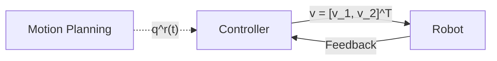
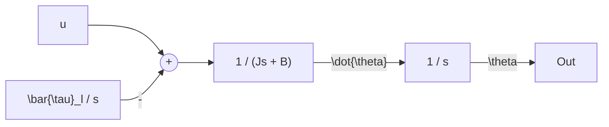

Here is a comprehensive summary of the lecture notes. I have structured the content, formatted the mathematics using LaTeX, and added corrections and missing derivations to ensure the notes are mathematically rigorous and self-contained.

---

# Robot Control Part 1

## High-Level Control Architecture

The basic architecture of a robot control system consists of a motion planner generating a reference trajectory, a controller that calculates the required inputs, and the physical robot dynamics.

*Here, $q^r(t)$ is the reference joint trajectory and $v$ represents the control input vector (e.g., voltages applied to the motors).*

## Two Approaches to Controlling Robots

1.  **Decentralized:** Design a separate controller for each joint, ignoring the dynamical interconnections (coupling effects like Coriolis or centrifugal forces) with other links.
2.  **Centralized:** Design the whole control vector taking into account the entire coupled robot dynamics.

---

## Decentralized Approach: DC Motor Dynamics

Assume we are using a DC motor to actuate joint $i$.
*   **Mechanical Variables:** $q_i$ or $\theta_i$ represents the joint angle.
*   **Electrical Variables:** $v$ is applied voltage, $i_a$ is armature current.
*   **Torques:** $\tau_m$ is motor torque, $\tau_l$ is load torque (disturbances, gravity, coupling).

The mechanical dynamics of the motor and link can be written as:
$$J\ddot{\theta} + B_m\dot{\theta} = \tau_m - \tau_l$$
Where:
*   $J$ = moment of inertia
*   $B_m$ = motor viscous friction
*   $\tau_m$ = motor generated torque
*   $\tau_l$ = load torque

### Quasi-Steady-State Approximation
Under a quasi-steady-state approximation (assuming electrical dynamics are much faster than mechanical dynamics, so inductance $L \approx 0$), we can incorporate the current ($i_a$) dynamics into the mechanical dynamics.

> **Instructor Note / Correction:**
> The handwritten notes contain a slight transcription error in combining the friction and back-EMF terms. They write $B_m \frac{K_m K_b}{R}$. Dimensionally and physically, the back-EMF acts as *additional* damping, so these terms must be added.
>
> **Derivation (Filling the gap):**
> 1. Motor torque is proportional to current: $\tau_m = K_m i_a$
> 2. With $L \approx 0$, the circuit equation is: $V = i_a R + K_b \dot{\theta} \implies i_a = \frac{V - K_b \dot{\theta}}{R}$
> 3. Substituting $i_a$ into the mechanical equation:
>    $$J\ddot{\theta} + B_m\dot{\theta} = \frac{K_m}{R}(V - K_b \dot{\theta}) - \tau_l$$
>    $$J\ddot{\theta} + \left(B_m + \frac{K_m K_b}{R}\right)\dot{\theta} = \frac{K_m}{R}V - \tau_l$$

By defining equivalent parameters, we simplify the model:
Let **equivalent friction** $B := B_m + \frac{K_m K_b}{R}$ and **control input** $u := \frac{K_m}{R}V$.
This gives us the standard simplified plant equation:
$$J\ddot{\theta} + B\dot{\theta} = u - \tau_l$$

Taking the Laplace Transform (assuming zero initial conditions):
$$(s^2J + Bs)\mathcal{L}\{\theta\} = \mathcal{L}\{u\} - \mathcal{L}\{\tau_l\}$$

### System Block Diagram (Open Loop)
Assuming the load torque is a constant disturbance $\tau_l(t) = \bar{\tau}_l$, its Laplace transform is $\mathcal{L}\{\tau_l\} = \frac{\bar{\tau}_l}{s}$.

---

## Closed-Loop Control and Internal Model Principle

We want to make the actual angle $\theta(t)$ track a reference trajectory $\theta_r(t)$. Assume a constant setpoint $\theta_r(t) = \theta_d$, which in the Laplace domain is $\frac{\theta_d}{s}$.

### Internal Model Principle (For constant reference & constant disturbance)
The notes outline the following principles for steady-state error $e(t) = \theta_d - \theta(t)$:

1.  Assume the Transfer Function (TF) of the closed-loop system is Bounded-Input Bounded-Output (BIBO) stable (i.e., all poles have $\text{Re}(s) < 0$).
    *   If there is **no disturbance** ($\bar{\tau}_l = 0$), then $e(t) \to 0$ as $t \to \infty$.
    *   If there **is a disturbance** ($\bar{\tau}_l \neq 0$), then $e(t) \to \text{constant}$ (but not necessarily zero).
2.  If the controller has a **pole at $s=0$** (an integrator) AND the system maintains BIBO stability, then $e(t) \to 0$ even when $\bar{\tau}_l \neq 0$.

---

## Proportional-Derivative (PD) Controller Analysis

Consider a PD controller:
*   **Time domain:** $u(t) = K_p e(t) + K_d \dot{e}(t)$
*   **Laplace domain:** $U(s) = (K_p + K_d s) E(s)$

### General Error Transfer Function

> **Instructor Note / Correction on Disturbance Sign:**
> The notes write the general error transfer function as $E(s) = \frac{1}{1+CG}R(s) + \frac{-G}{1+CG}D(s)$. However, in standard robotics block diagrams, the load torque $D(s)$ is *subtracted* from the control effort (as shown in your earlier blocks).
> If $Y = G(U - D)$ and $U = CE$, then $E = R - Y = R - GCE + GD$.
> Solving for $E$ yields a **positive** sign for the disturbance term:
> $$E(s) = \frac{1}{1+CG}R(s) + \frac{G}{1+CG}D(s)$$
> The specific equation derived later in the notes correctly uses the positive sign.

### Specific Error TF for the PD Controller
Let Plant $G(s) = \frac{1}{Js^2 + Bs}$ and Controller $C(s) = K_p + K_d s$.
Substitute these into the corrected general $E(s)$ formula:

$$E(s) = \frac{Js^2 + Bs}{Js^2 + (B+K_d)s + K_p} \underbrace{\left(\frac{\theta_d}{s}\right)}_{R(s)} + \frac{1}{Js^2 + (B+K_d)s + K_p} \underbrace{\left(\frac{\bar{\tau}_l}{s}\right)}_{D(s)}$$

### Steady-State Error Evaluation

> **Filling the Gap (Final Value Theorem):**
> The notes state $e(t) \to \text{constant}$. We can prove this using the Final Value Theorem: $\lim_{t \to \infty} e(t) = \lim_{s \to 0} s E(s)$.
> $$s E(s) = \frac{Js^2 + Bs}{Js^2 + (B+K_d)s + K_p} \theta_d + \frac{1}{Js^2 + (B+K_d)s + K_p} \bar{\tau}_l$$
> Taking the limit as $s \to 0$:
> *   The first term goes to $0$ (due to the $s$ in the numerator).
> *   The second term goes to $\frac{1}{K_p} \bar{\tau}_l$.
>
> Therefore, $e(\infty) = \frac{\bar{\tau}_l}{K_p}$, which is a constant.

### Stability Analysis
The system is stable provided the roots of the characteristic equation have real parts $< 0$.
The characteristic equation is:
$$Js^2 + (B+K_d)s + K_p = 0$$

Dividing by $J$ to match the standard second-order form ($s^2 + 2\zeta\omega_n s + \omega_n^2 = 0$):
$$s^2 + \left(\frac{B+K_d}{J}\right)s + \left(\frac{K_p}{J}\right) = 0$$

By the Routh-Hurwitz criterion for a second-order polynomial, the roots are strictly in the left-half plane ($\text{Re}(s) < 0$) if and only if all coefficients are positive.
Assuming physical parameters $J > 0$ and $B > 0$, we conclude:
**For all $K_p > 0, K_d > 0$, the roots are in $\{ \text{Re}(s) < 0 \}$.**

Because the system is BIBO stable without an integrator pole in the controller, the steady-state error $e(t)$ evaluates to a non-zero constant when a constant disturbance is present.